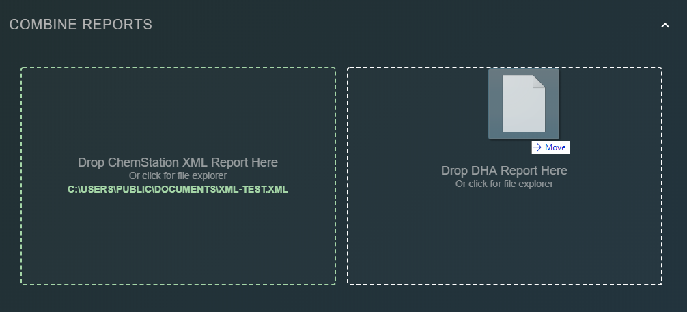

# Add Report Files

Once the user has selected the bridge component and report output directory \(see the [Configuration section](configuration.md)\), click the `Add Report Files` sidebar button to begin adding the appropriate files. The user must select two appropriate reports from which to generate the report:

1.  Drag a ChemStation XML report into the left file drop area, or click the file drop area to open a dialog to navigate to the appropriate file.
2. Likewise, select the correct DHA ASCII export file in the right file drop area.

If either report was unsuccessfully parsed by the bridging software, an error will be displayed in the file drop area where the issue occurred.  

