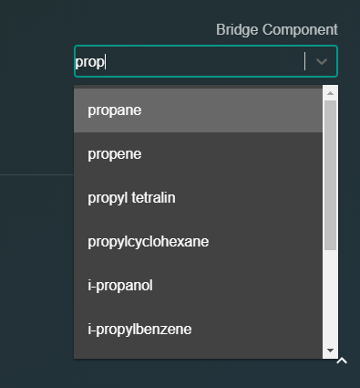
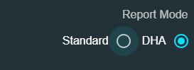
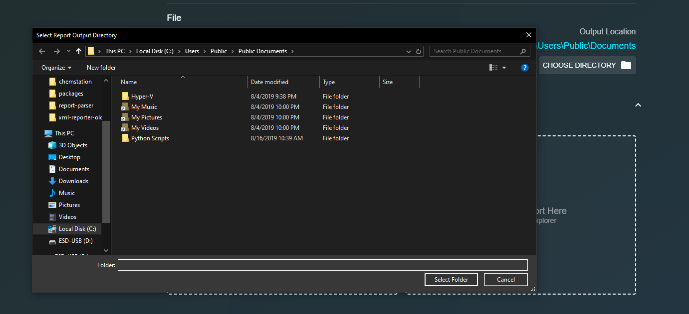

# Configuration

## Bridging

To begin editing the bridging configuration, select the `Edit Configuration` sidebar button.

### Bridge Component

The text input labeled `Bridge Component` is where one specifies the component which is common to both the standard ChemStation report and the DHA report. **The selected component must be present in both reports, or the output report cannot be generated.** Begin typing the name of the joint component and a drop down menu will appear with the closest matches.

### Report Mode

The radio group labeled `Report Mode`determines which report to consider the reference report by which the other report's analyte concentrations will be adjusted. Selecting the `Standard` radio option, for instance, means the report generator will search for the common component in the standard ChemStation report, and scale all components in the DHA report so that the common component concentrations match. The opposite is true if one instead selects the DHA radio option.  

## File Options

### Output Directory

After combining the ChemStation and DHA reports, the software must know where to place the new report. Click the `CHOOSE DIRECTORY` button under the `Output Location` label of the file configuration section. A directory dialog box will appear in which one must select the output location. The chosen directory now be visible under the `Output Location` label. **The output report cannot be saved unless the user has permission to write files to the chosen output directory.**  

## Remarks

The selected configuration options will persist on subsequent restarts of the bridging software. **If the user does not select a bridge component and an output directory, the generated report cannot be saved.**

