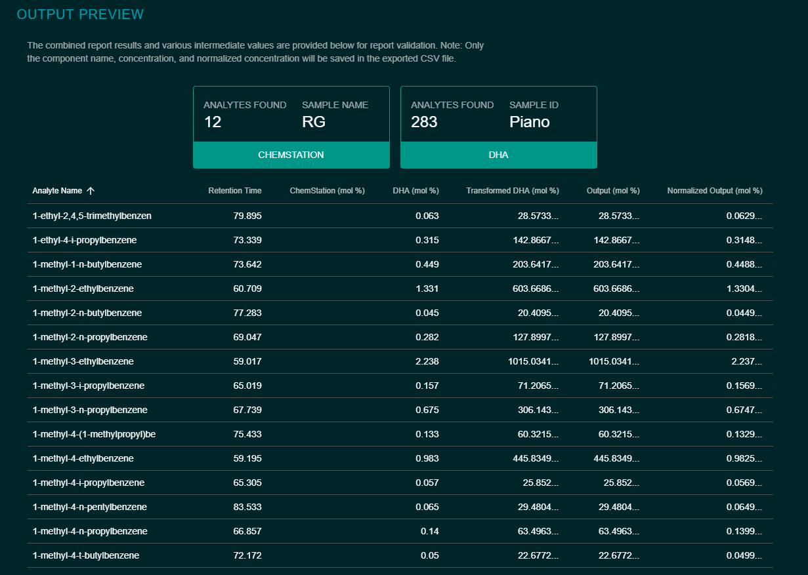

# Output Preview

Once either of the corresponding standard ChemStation and DHA reports have been uploaded, metadata and component information will populate in the output preview section, available by clicking the `View Output Preview` button. If _both_ reports were successfully uploaded, a table including the output analytes will render, including all identified analytes from each report, their retention times, corresponding ChemStation/DHA concentrations, and the calculated output concentration values that will be generated. The reference component common to both reports will be highlighted. **If the user adjusts any configuration values, the application will automatically recalculate and update the report output preview.** 

